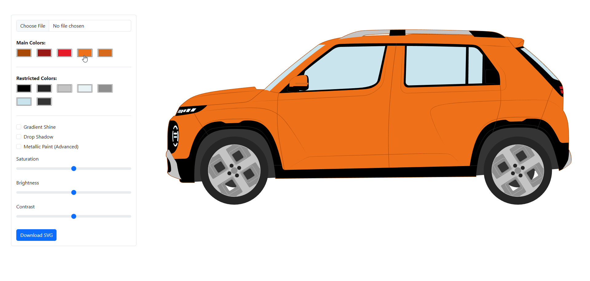

# SVG Paint & Filter Tool

A client-side Proof of Concept tool for dynamically recoloring SVG files and applying visual effects such as gradient shine, metallic paint, drop shadow, and color tuning — all using inline SVG manipulation in the browser.

This project was built as an exploration tool to experiment with making flat SVG illustrations (e.g. car drawings exported from Adobe Illustrator) look more vivid and visually rich while remaining fully vector-based.

## Live Demo
🔗 [https://www.mhdeveloper.com/curr-projects/svg-car](https://www.mhdeveloper.com/projects/svg-paint-tool)

## Features

- Upload and preview SVG files inline
- Automatically detect and group SVG fill colors
- Recolor SVG parts using color pickers
- Separate main colors and restricted colors
- Toggle visual effects without breaking the SVG:
  - Gradient shine (directional highlight)
  - Drop shadow
  - Metallic paint
  - Saturation, brightness, and contrast tuning
- Stack multiple effects together safely
- Export / download the customized SVG with inline styles

## How It Works

- SVG files are loaded and injected as inline SVG
- Colors are detected using computed `fill` values and normalized (RGB → HEX)
- Elements sharing the same color are grouped and recolored together
- All visual effects are applied using a single master SVG filter
- Effects are layered in a controlled pipeline to avoid conflicts
- The final SVG is serialized and exported with all styles preserved

## Technical Notes

- Fully client-side (no server processing)
- Vanilla JavaScript (no frameworks)
- Uses native SVG filters:
  - `feGaussianBlur`
  - `feSpecularLighting`
  - `feDropShadow`
  - `feColorMatrix`
- Modern browsers only (Chrome / Edge / Safari)

## Use Cases

- Visual experimentation for SVG illustrations
- Exploring paint and lighting techniques in SVG
- Proof-of-Concepts for configurators or customization tools
- Learning reference for advanced SVG filter pipelines

## Author

**Mohamed Hassan**  
Front-End Developer & UI/UX Specialist  
🌐 https://www.mhdeveloper.com

---

Feel free to fork, experiment, or build on top of this project.
